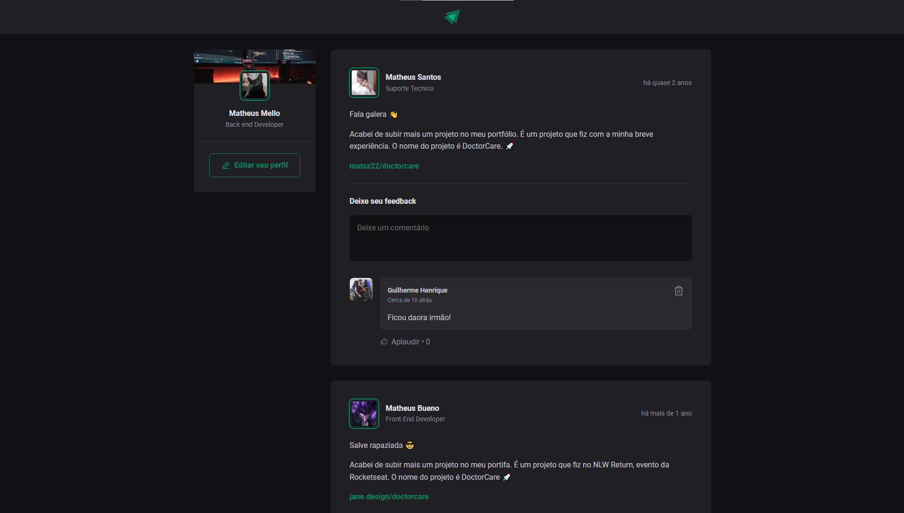

<h1 style="font-size: 40px; text-align: center; font-family: 'JetBrains Mono'">Ignite Feed 📖</h1>

 

Olá, tudo bem? 😎 Desenvolvi uma aplicação em React para aprimorar meus conhecimentos sobre essa tecnologia e compreender os principais aspectos da construção de páginas e aplicações usando React. Esta experiência me proporcionou aprendizados significativos sobre o React e seus fundamentos, tais como useState, imutabilidade, JSX, closures, entre outros,a aplicação possui funcionalidades simples, como criação de posts, comentários e exclusão dos mesmos.
  

  

