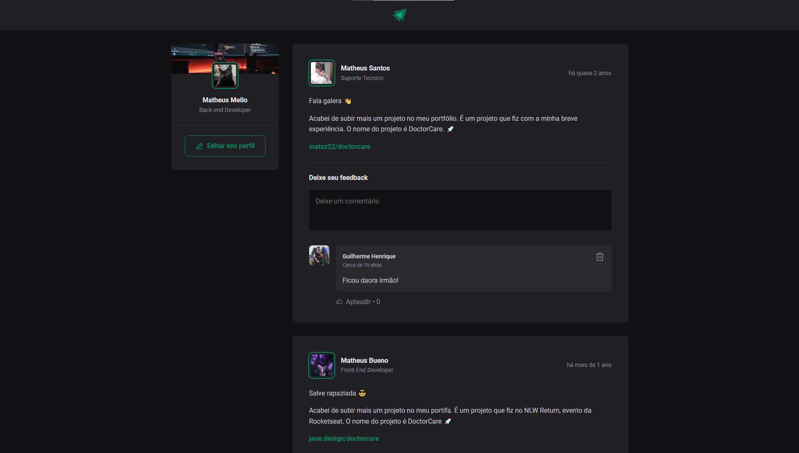

# Ignite Feed

A interface foi desenvolvida com o objetivo de aprimorar meus estudos em React. Ela possui funcionalidades simples, como criação de postagens, comentários e exclusão dos mesmos.

# Configurações 

### Requisitos
- [Node.js](https://nodejs.org/en)

**Clone o projeto e acesse a pasta**

``` bash
git clone git@github.com:matheusgmello/ignite-feed.git && cd ignite-feed
```
 
- Clone o repositório 
- Instalar dependências (`npm i`)
- Rode a aplicação (`npm run dev`)
- Abra o navegador no endereço (`localhost:5173`)

## Tecnologias 

- [React](https://react.dev/)
- [TypeScript](https://www.typescriptlang.org/docs/)
- [Vite](https://vitejs.dev/)

<!--START_SECTION:footer-->
<br />

## 🔗 Connect with me
[](https://linkedin.com/in/matheusgmello)
[](https://www.reddit.com/user/math7zw)
[](https://github.com/matheusgmello/)


<!--END_SECTION:footer-->


